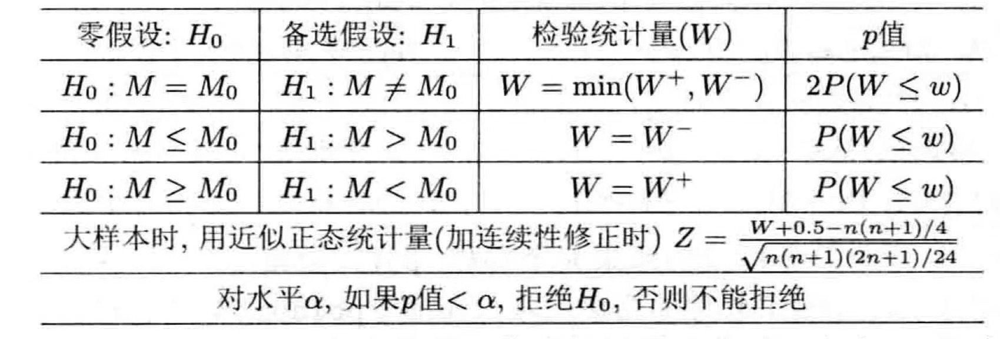

```{r setup, include=FALSE}
knitr::opts_chunk$set(echo = TRUE)
```

```{r include=FALSE}
setwd("F:/学习文件集/考研/Statistics/Non-parametric Statistics")
```

# 秩、结、记分统计量

# 单变量位置推断
## 符号检验：中位数检验
根据简单随机样本，检验某值$m$是否为总体的中位数。

$H_0$：$F(x_{\frac{1}{2}})=m$

$H_1$：$F(x_{\frac{1}{2}})\neq m$

预处理：按照规则$I(x_i\geq m)\ \ \ i=1,2,\cdots,n$将样本处理为只含$0$、$1$的新序列。记$0$出现的次数为$n_0$，$1$出现的次数为$n_1$。

根据假设，$n_1\ \ (n_0+n_1=n)$应该是来自$S^+\sim b(n,\frac{1}{2})$。拒绝域为$\{0,1,\cdots,c_1\}\cup\{c_2,c_2+1,\cdots,n\}$，其中$c_1$与$c_2$满足：$P(S^+\leq c_1)\leq\frac{\alpha}{2}\ \ \ P(S^+\geq c_2)\leq\frac{\alpha}{2}$。

## 游程检验
用于检验简单随机样本序列的顺序是否随机。

预处理：取样本中值$x_m$，按照规则$I(x_i\geq x_m)\ \ \ i=1,2,\cdots,n$，将样本处理为一个只含有$0$、$1$的新序列。

$H_0$：该新序列为来自总体$b(1,0.5)$的简单随机样本。

此时，$0$出现的次数$n_0$与$1$出现的次数$n_1$为确定值，游程数$R$为分布已知的随机变量：

$$P(R=2k)=\frac{2C_{n_1-1}^{k-1}C_{n_0-1}^{k-1}}{C_{n_1+n_2}^{n_1}}$$

$$P(R=2k+1)=\frac{C_{n_1-1}^{k-1}C_{n_0-1}^k+C_{n_1-1}^kC_{n_0-1}^{k-1}}{C_{n_1+n_2}^{n_1}}$$
，其中$k=1,2,\cdots,\lfloor\frac{n-1}{2}\rfloor$。

**<font color="red" size=4>大样本下的正态近似</font>**：
$$E(R)=\frac{2n_0n_1}{n_0+n_1}+1$$
$$Var(R)=\frac{2n_1n_0(2n_0n_1-n_0-n_1)}{(n_1+n_0)^2(n_1+n_0-1)}$$

$$\frac{R-E(R)}{\sqrt{Var(R)}}\mathop{\rightarrow}^LN(0,1)$$

## Wilcoxon符号秩和检验
在总体分布具有对称性和连续性时，根据简单随机样本，检验某值是否为总体的中位数。

$H_0$：$F(x_{\frac{1}{2}})=m$

$H_1$：$F(x_{\frac{1}{2}})\neq m$

预处理：$$\begin{matrix}原样本&x_1&x_2&\cdots&x_n\\处理方法&x_1-m&x_2-m&\cdots&x_n-m\\标记正负&+&-&\cdots&-\\绝对值的秩&R_1&R_2&\cdots&R_n\end{matrix}$$

Wilcoxon统计量：$$W^+=\sum_{i=1}^nR_iI(x_i-m>0)$$$$W^-=\sum_{i=1}^nR_iI(x_i-m<0)$$$$W=\min\{W^+,W^-\}$$，其中$W$的分布依赖于$n$，$p=2P(W\leq w)$。

**<font color="red" size=4>大样本下的正态近似</font>**：

$$E(W)=\frac{n(n+1)}{4}$$$$Var(W)=\frac{n(n+1)(2n+1)}{24}$$$$\frac{W-E(W)}{\sqrt{Var(W)}}\mathop{\rightarrow}^LN(0,1)$$

```{r figname, echo=FALSE, fig.cap="", out.width="100", out.height="100" }

```


# 相关系数
## Spearman相关系数及其检验
设$\begin{matrix}y_1&y_2&\cdots&y_{n-1}&y_n\\x_1&x_2&\cdots&x_{n-1}&x_n\end{matrix}$及其对应的记分秩$\begin{matrix}R_1&R_2&\cdots&R_{n-1}&R_n\\S_1&S_2&\cdots&S_{n-1}&S_n\end{matrix}$。

Spearman相关系数：$$r_s=\frac{\sum(R_i-\bar{R})(S_i-\bar{S})}{\sqrt{\sum(R_i-\bar{R})^2\sum(S-\bar{S})^2}}$$，若原数据没有打结，则还有$$r_s=1-\frac{6\sum d_i^2}{n(n^2-1)}$$，其中$d_i^2=(R_i-S_i)^2$。
```{r}
a <- c(1:10)
b <- (a-5)**2 # b为打结数据
cor(a, b, method='spearman')  # 计算结果为上述r_s的第一个等式的结果
```


# 分类数据的关联分析
## Fisher精确检验（低维列联表）
针对$2\times2$维列联表$\begin{matrix}&B_1&B_2&Total\\A_1&n_{11}&n_{12}&n_{1\cdot}\\A_2&n_{21}&n_{22}&n_{2\cdot}\\Total&n_{\cdot1}&n_{\cdot2}&n_{\cdot\cdot}\end{matrix}$，其中$n_{1\cdot}$、$n_{2\cdot}$、$n_{\cdot1}$、$n_{\cdot2}$、$n_{\cdot\cdot}$为确定值。该列联表中确定一个值后其余值随之确定。

在“$H_0:$$A$与$B$相互独立”的条件下，有$N_{11}\sim h(n_{\cdot1},n_{\cdot\cdot},n_{1\cdot})$，从而有$$P(N_{11}=k)=\frac{C_{n_{1\cdot}}^{k}C_{n_{\cdot\cdot}-n_{1\cdot}}^{n_{\cdot1}-k}}{C_{n_{\cdot\cdot}}^{n_{\cdot1}}}$$，据此精确分布可根据$p$值进行检验。

当样本量较大时，有$$\frac{\sqrt{n_{\cdot\cdot}}(n_{11}n_{22}-n_{12}n_{21})}{\sqrt{n_{1\cdot}n_{2\cdot}n_{\cdot1}n_{\cdot2}}}\mathop{\sim}^\limits{.}N(0,1)$$

**<font color="orange" size=3>Fisher检验还可以用于$m\times n$维的列联表检验，后面再补上</font>**

## Pearson's卡方拟合优度检验
### 卡方拟合优度检验
$H_0$：$\begin{matrix}总体类别&A_1&A_2&\cdots&A_r\\各自比例&p_{10}&p_{20}&\cdots&p_{r0}\end{matrix}$

$H_1$：至少有一种类别与其比例不对应。

设样本中各种类的比例为：$p_1$、$p_2$、$\cdots$、$p_r$。Pearson's $\chi^2$统计量：$$\sum_{i=1}^r\frac{(p_i-p_{i0})^2}{p_{i0}}\mathop{\sim}^\limits{.}\chi^2(r-1)$$，其中当$r>2$，$\min\{n_1,n_2,\cdots,n_r\}\rightarrow\infty$时，上述近似分布成立。如果$H_0$中的$k$个未知参数需要用样本估计，则统计量的卡方自由度为$r-k-1$。

**<font color="green" size=3>例：离散分布的卡方拟合优度检验</font>**

设卢瑟福试验数据$\begin{matrix}质点数&0&1&2&3&4&5&6&7&8&9&10&11&12&13&14\\观察数&57&203&383&525&532&408&273&139&45&27&10&4&2&0&0\end{matrix}$

$H_0$：上述质点观察数符合$P(\lambda)$分布。

将上述质点数分为12类，将质点数$\geq11$的情况归为一类，该类的观测数为6，并保证每一类观测的最低个数不低于5。使用最大似然估计法得$\hat{\lambda}=\bar{x}=3.87$。

则$H_0$可以被近似等价转化为：$$\begin{matrix}总体类别&0&1&2&3&4&5&6&7&8&9&10&\geq11\\观察数&57&203&383&525&532&408&273&139&45&27&10&6\end{matrix}$$

计算得到：$$\sum_{i=1}^{12}\frac{(p_i-p_{i0})^2}{p_{i0}}=12.8967<\chi^2(12-1-1)=18.3$$，故不能拒绝$H_0$。

**<font color="green" size=3>例：连续分布的卡方拟合优度检验</font>**

依然需要将连续分布的取值范围做区间分割，保证每一个区间的观测数大于5，之后用相似的方法进行检验即可。但此时的原假设相当于：

$H_0$：$p_i=P(a_{i-1}<X\leq a_{i})=F_0(a_i)-F_0(a_{i-1})\ \ \ i=1,2,\cdots,r$

故如何分组会影响对连续分布的拟合优度检验。

### 列联表独立性检验（高维列联表）
针对$m\times n$维列联表$\begin{matrix}&B_1&B_2&\cdots&B_n&Total\\A_1&n_{11}&n_{12}&\cdots&n_{1n}&n_{1\cdot}\\A_2&n_{21}&n_{22}&\cdots&n_{2n}&n_{2\cdot}\\\vdots&\vdots&\vdots&\ddots&\vdots&\vdots\\A_m&n_{m1}&n_{m2}&\cdots&n_{mn}&n_{m\cdot}\\Total&n_{\cdot1}&n_{\cdot2}&\cdots&n_{\cdot n}&n_{\cdot\cdot}\end{matrix}$

$H_0$：列联表中第$i$行第$j$列的类别对应的比例为$p_{ij}=p_{i\cdot}p_{\cdot j}=\frac{n_{i\cdot}}{n_{\cdot\cdot}}\frac{n_{\cdot j}}{n_{\cdot\cdot}}$。

$H_1$：至少存在某一列别与其比例不对应。

将Pearson's$\chi^2$统计量扩展到2维的情况：$$\sum_{i=1}^m\sum_{j=1}^n\frac{(n_{ij}-n_{\cdot\cdot}p_{ij})^2}{n_{\cdot\cdot}p_{ij}}\mathop{\sim}^\limits{.}\chi^2\big{(}(m-1)(n-1)\big{)}$$，其中Siegel和Castellan（1988）指出上述近似分布应该满足以下条件：

(1) 行数和列数至少有一者超过2；

(2) 期望频数低于5的单元格数目不应该超过总单元格数的20%，且所有单元格期望频数不小于1。


